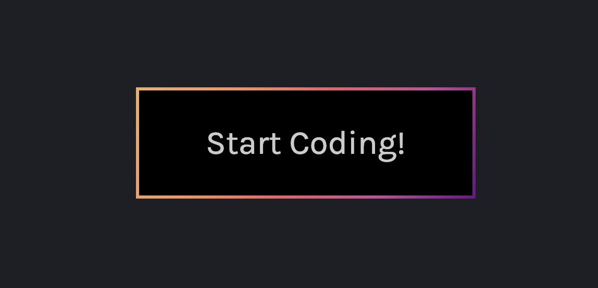
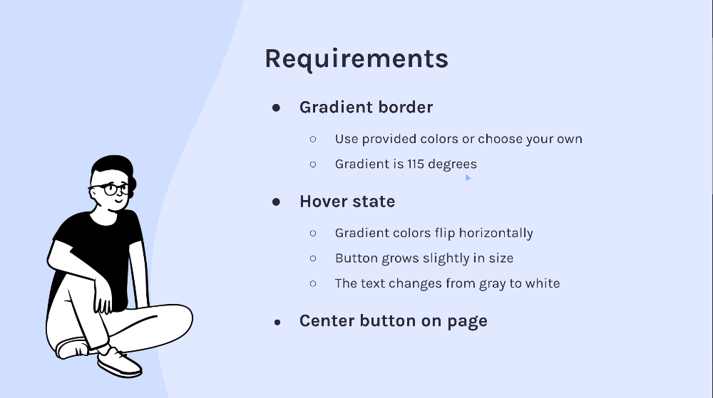
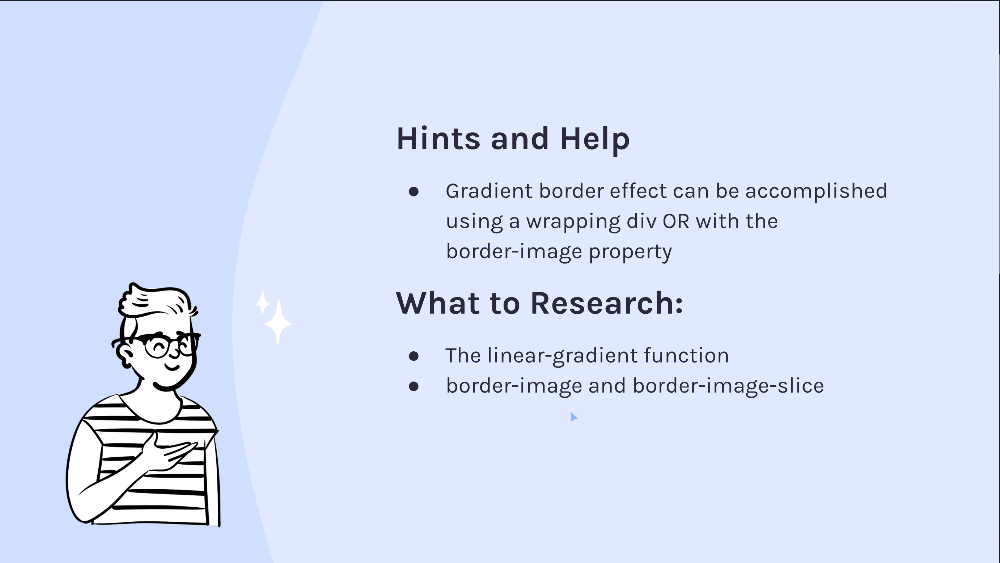

# JavaScriptmas Day 2: Gradient Border Button Challenge

## Overview
This project is part of the Scrimba JavaScriptmas challenges, focusing on creating a button with a dynamic gradient border. The challenge is intended to practice CSS skills, particularly in using gradients and hover effects.




## Table of Contents
1. [Project Overview](#overview)
2. [Features](#features)
3. [Requirements](#requirements)
4. [Gradient 101](#gradient-101)
5. [Implementation](#implementation)
7. [Setup](#setup)

## Features
- A button with a gradient border that changes on hover.
- The gradient is at a 115-degree angle by default and flips to 295 degrees on hover.
- The button is centrally aligned on the page.

## Requirements
The button implementation should follow these design requirements:



And here are some hints to help with the implementation:



## Gradient 101

CSS gradients are smooth transitions between two or more specified colors. They can be linear, radial, or conic. In this project, we're focusing on linear gradients, which progress along a straight line.

### What does the 115-degree angle mean?

In a linear gradient, the angle controls the tilt of the gradient line. An angle of 0 degrees creates a vertical gradient, 90 degrees produces a horizontal gradient, and 115 degrees tilts the gradient line by 115 degrees from the vertical axis, creating a diagonal effect.

### Gradient Syntax

The basic syntax for a linear gradient in CSS is as follows:

```css
element {
    background: linear-gradient(angle, color-stop1, color-stop2, ...);
}
```

- `element` is the selector of the HTML element you want to style.
- `angle` is the direction of the gradient line.
- `color-stop` values are the colors you want to include in the gradient.


### Implementing a Gradient

To implement a gradient for our button border, we use the `border-image` property along with `linear-gradient()`:

```css
.button-border {
    border: 3px solid; /* Define border size */
    border-image: linear-gradient(115deg, var(--grad-color1), var(--grad-color2), var(--grad-color3), var(--grad-color4), var(--grad-color5)) 1;
}
```

In this snippet:

- We use custom properties (CSS variables) for our colors, which are declared in the `:root` selector.
- The `1` at the end of the `border-image` value is shorthand for `border-image-slice`, which specifies how to slice the gradient image for the border.

Understanding these basics will enable you to create visually appealing designs and take your UI to the next level.

## Setup
To get started with the project, clone the repository and open `index.html` in a web browser.

Quick start:

```
$ npm install
$ npm start
````

Head over to https://vitejs.dev/ to learn more about using vite
## About Scrimba

At Scrimba our goal is to create the best possible coding school at the cost of a gym membership! 💜
If we succeed with this, it will give anyone who wants to become a software developer a realistic shot at succeeding, regardless of where they live and the size of their wallets 🎉
The Frontend Developer Career Path aims to teach you everything you need to become a Junior Developer, or you could take a deep-dive with one of our advanced courses 🚀

- [Our courses](https://scrimba.com/allcourses)
- [The Frontend Career Path](https://scrimba.com/learn/frontend)
- [Become a Scrimba Pro member](https://scrimba.com/pricing)

Happy Coding!
